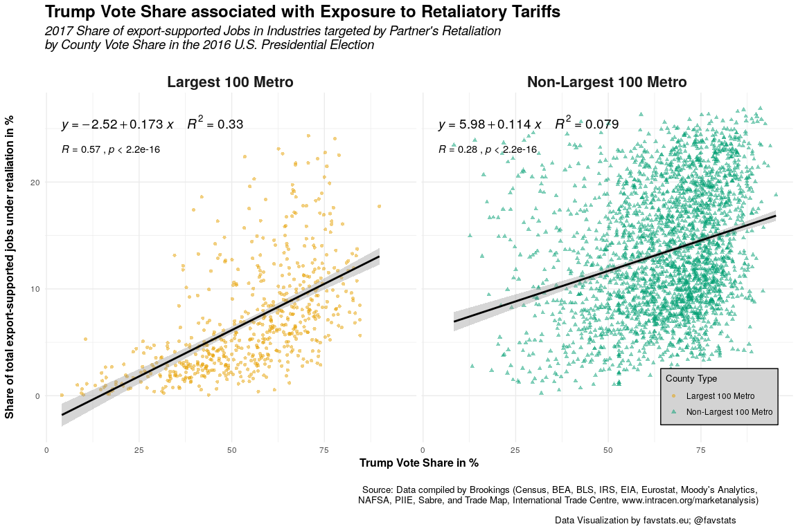
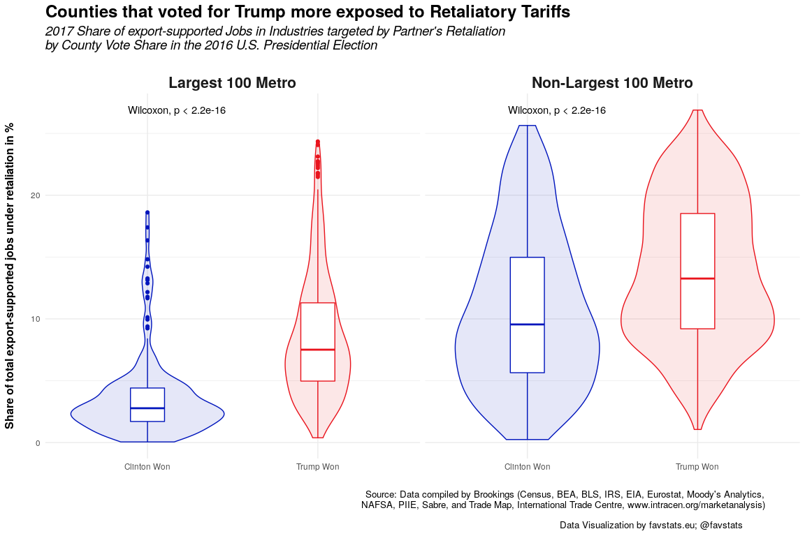

Retaliatory Tariffs
================
Fabio Votta

Packages and Folders
--------------------

``` r
# Install these packages if you don't have theme yet
# devtools::install_github("favstats/tidytemplate")
# install.packages("pacman")

pacman::p_load(tidyverse, httr, janitor, ggpmisc, urbnmapr, glue, ggthemes, tidytemplate, cowplot, ggpubr)

# Creates folders
# tidytemplate::data_dir()
# tidytemplate::images_dir()
options(scipen = 1)
```

Load Data
---------

Note: Changes to County Data

<https://www.economy.com/support/blog/buffet.aspx?did=50094FC4-C32C-4CCA-862A-264BC890E13B>

Wade Hampton Census Area, Alaska (02-270) Changed name and code to Kusilvak Census Area (02-158) effective July 1, 2015.

Oglala Lakota County, South Dakota (46-102) Changed name and code from Shannon County (46-113) effective May 1, 2015.

Bedford + Bedford City changed to Bedford County

FIPS Modifications:

<https://apps.bea.gov/regional/xls/FIPSModifications.xlsx>

``` r
## County Retaliation Data
county_retaliation <-  tidytemplate::load_it("data/county_retaliation.Rdata") %>% 
  mutate(c_fips_lgc_ = ifelse(nchar(c_fips_lgc_) == 4, paste0(0, c_fips_lgc_), c_fips_lgc_))  %>% 
  mutate(c_fips_lgc_ = case_when(
    ## Wade Hampton Census Area changed to Kusilvak Census Area
    c_fips_lgc_ == "02270" ~ "02158",
    ## Shannon County to Oglala Lakota County
    c_fips_lgc_ == "46113" ~ "46102",
    ## Bedford + Bedford City changed to Bedford County
    c_fips_lgc_ == "51909" ~ "51019",
    T ~ c_fips_lgc_
  ))

## Bea Codes
bea_codes <- tidytemplate::load_it("data/bea_codes2.Rdata") %>% 
  mutate(bea_codes = as.character(bea_codes)) %>% 
  mutate(county_fips = as.character(county_fips)) %>% 
  select(bea_codes, county_fips)

beas <- county_retaliation %>% #filter(c_fips_lgc_ == "15901")
  inner_join(bea_codes, by = c("c_fips_lgc_" = "bea_codes")) %>% 
  select(-c_fips_lgc_)

## Election Data
elec2016_url<- "https://github.com/tonmcg/US_County_Level_Election_Results_08-16/raw/master/2016_US_County_Level_Presidential_Results.csv"
              
elec2016 <- readr::read_csv(elec2016_url) %>%  
  mutate(combined_fips = ifelse(nchar(combined_fips) == 4, paste0(0, combined_fips), combined_fips)) %>% 
  rename(county_fips = combined_fips) %>% 
  select(-county_name) %>% 
  mutate(county_fips = case_when(
    ## Wade Hampton Census Area changed to Kusilvak Census Area
    county_fips == "02270" ~ "02158",
    ## Shannon County to Oglala Lakota County
    county_fips == "46113" ~ "46102",
    ## Bedford + Bedford City changed to Bedford County
    county_fips == "51909" ~ "51019",
    T ~ county_fips
  ))
```

    ## Warning: Missing column names filled in: 'X1' [1]

    ## Parsed with column specification:
    ## cols(
    ##   X1 = col_integer(),
    ##   votes_dem = col_double(),
    ##   votes_gop = col_double(),
    ##   total_votes = col_double(),
    ##   per_dem = col_double(),
    ##   per_gop = col_double(),
    ##   diff = col_number(),
    ##   per_point_diff = col_character(),
    ##   state_abbr = col_character(),
    ##   county_name = col_character(),
    ##   combined_fips = col_integer()
    ## )

Combining
---------

``` r
retaliation_dat <- county_retaliation %>% 
  rename(county_fips = c_fips_lgc_) %>%
  bind_rows(beas) %>% 
  inner_join(elec2016) %>%   
  mutate(voteshare = per_gop - per_dem)
```

    ## Joining, by = "county_fips"

``` r
tidytemplate::save_it(retaliation_dat)
```

Scatterplot
-----------

``` r
formula <- y ~ poly(x, 1, raw = TRUE)

scatter_plot <- retaliation_dat %>% 
  mutate(per_gop = 100 * per_gop) %>% 
  mutate(share_ret_xjd = 100 * share_ret_xjd) %>% 
  # ggplot(aes(voteshare)) +geom_histogram()
  ggplot(aes(per_gop, share_ret_xjd)) +
  geom_point(aes(color = h_label_lgc_lgm_lgh_, 
                 shape = h_label_lgc_lgm_lgh_), alpha = 0.5) +
  geom_smooth(method = "lm", formula = formula, color = "black") +
  stat_poly_eq(aes(label =  paste(..eq.label.., ..rr.label.., sep = "~~~~")),
               formula = formula, parse = TRUE, size = 5) +
  theme_minimal() +
  scale_color_manual("County Type", values = ggthemes::colorblind_pal()(5)[c(2,4)]) +
  scale_shape("County Type") +
  labs(x = "Trump Vote Share in %\n", y = "Share of total export-supported jobs under retaliation in %\n",
       title = "Trump Vote Share associated with Exposure to Retaliatory Tariffs",
       subtitle = "2017 Share of export-supported Jobs in Industries targeted by Partner's Retaliation\nby County Vote Share in the 2016 U.S. Presidential Election\n",
       caption = "Source: Data compiled by Brookings (Census, BEA, BLS, IRS, EIA, Eurostat, Moody's Analytics,\nNAFSA, PIIE, Sabre, and Trade Map, International Trade Centre, www.intracen.org/marketanalysis)\n\nData Visualization by favstats.eu; @favstats") +
  theme(
    plot.title = element_text(size = 18, face = "bold"),
    plot.subtitle = element_text(size = 14, face = "italic"),
    strip.text = element_text(size = 16, face = "bold"),
    plot.caption = element_text(size = 10, hjust = 0.9),
    legend.justification = c(1, 0),
    legend.position = c(0.98, 0.05),
    legend.background = element_rect(fill = "lightgrey"),
    legend.title = element_text(size = 10),
    axis.title = element_text(size = 12, face = "bold"),
    #axis.ticks.length = unit(3, "cm"),
    legend.direction = "vertical") +
  facet_wrap(~h_label_lgc_lgm_lgh_) +
  ggpubr::stat_cor(label.y = 23)

scatter_plot
```



``` r
ggsave_it(scatter_plot, width = 12, height = 8)
```

Boxplot
-------

``` r
boxes <- retaliation_dat %>% 
  mutate(per_gop = 100 * per_gop) %>% 
  mutate(per_dem = 100 * per_dem) %>% 
  mutate(share_ret_xjd = 100 * share_ret_xjd) %>% 
  mutate(win = case_when(
    per_gop > per_dem ~ "Trump Won",
    per_dem > per_gop ~ "Clinton Won")) %>% 
  ggplot(aes(win, share_ret_xjd, color = win)) +
  geom_violin(aes(fill = win), alpha = 0.1) +
  geom_boxplot(width = 0.2) +
  facet_wrap(~h_label_lgc_lgm_lgh_) +
  theme_minimal()  +
  scale_color_manual(values = c("#0015BC", "#E9141D")) +
  scale_fill_manual(values = c("#0015BC", "#E9141D")) +
  guides(color = F, fill = F) +
  labs(x = "", y = "Share of total export-supported jobs under retaliation in %\n",
       title = "Counties that voted for Trump more exposed to Retaliatory Tariffs",
       subtitle = "2017 Share of export-supported Jobs in Industries targeted by Partner's Retaliation\nby County Vote Share in the 2016 U.S. Presidential Election\n",
       caption = "Source: Data compiled by Brookings (Census, BEA, BLS, IRS, EIA, Eurostat, Moody's Analytics,\nNAFSA, PIIE, Sabre, and Trade Map, International Trade Centre, www.intracen.org/marketanalysis)\n\nData Visualization by favstats.eu; @favstats") +
  theme(
    plot.title = element_text(size = 18, face = "bold"),
    plot.subtitle = element_text(size = 14, face = "italic"),
    strip.text = element_text(size = 16, face = "bold"),
    plot.caption = element_text(size = 10, hjust = 0.9),
    legend.justification = c(1, 0),
    legend.position = c(0.98, 0.05),
    legend.background = element_rect(fill = "lightgrey"),
    legend.title = element_text(size = 10),
    axis.title = element_text(size = 12, face = "bold"),
    #axis.ticks.length = unit(3, "cm"),
    legend.direction = "vertical") +
    stat_compare_means() 
  
boxes
```



``` r
ggsave_it(boxes, width = 12, height = 8)
```

Mapping
-------

``` r
share_ret_xn_plot <- retaliation_dat %>%
  mutate(trump_win = ifelse(per_gop >= .5, "Win", "Lost")) %>% 
  mutate(per_gop = 100 * per_gop) %>% 
  mutate(per_dem = 100 * per_dem) %>% 
  mutate(share_ret_xjd = 100 * share_ret_xjd) %>% 
  mutate(voteshare = per_gop - per_dem) %>% 
  inner_join(urbnmapr::counties) %>% 
  ggplot(aes(long, lat, 
             group = group,
             fill = voteshare, 
             alpha = share_ret_xjd)) +
  geom_polygon(color = "white", size = 0.05) +
  coord_map() +
  theme_map() +
  scale_fill_gradient2("",
                       low = "#0015BC", 
                       mid = "lightgrey", 
                       high = "#E9141D", 
                       labels = c("+50% Trump", "+50% Clinton"), 
                       breaks = c(50, -50)
                        ) +
  scale_alpha("",
              labels = paste0(seq(5, 25, 5), "%"), 
              breaks = seq(5, 25, 5)) +
  theme(
    plot.title = element_text(size = 18, face = "bold", hjust = 0),
    plot.subtitle = element_text(size = 14, face = "italic", hjust = 0),
    plot.caption = element_text(size = 10, hjust = 0.1),
    legend.justification = c(0, 0.5),
    legend.position = c(0.86, 0.33),
    plot.margin=unit(c(0,0,0,0),"mm"),
    legend.title.align = 0.5,
    legend.title = element_text(size = 10)
    )  +
  guides(
    fill = guide_colorbar(
                barwidth = 1.05, 
                barheight = 6,#8, 
                title.position = "bottom", 
                legend.direction = "vertical",
                label.theme = element_text(colour = "black", size = 9, angle = 0)),
  alpha = guide_legend(
                title.position = "right", 
                title.hjust = 1,
                direction = "vertical", 
               label.theme = element_text(colour = "black", size = 9, angle = 0))
  ) +
  labs(x = "", y = "",
       title = "Counties that voted for Trump most exposed to Retaliatory Tariffs",
       subtitle = "2017 Share of export-supported Jobs in Industries targeted by Partner's Retaliation\nby County Vote Share in the 2016 U.S. Presidential Election",
       caption = "\nSource: Data compiled by Brookings (Census, BEA, BLS, IRS, EIA, Eurostat, Moody's Analytics,\nNAFSA, PIIE, Sabre, and Trade Map, International Trade Centre, www.intracen.org/marketanalysis)\n\nData Visualization by favstats.eu; @favstats\n") +
  annotate(geom = "text", x = -80, y = 21.3,#,24.3
           label = "Share of total export-supported Jobs under Retaliation") +
  annotate(geom = "text", x = -77, y = 48.5, 
           label = "Darker shaded Counties correspond to greater % of\nexport-supported Jobs under Retaliation") 
```

    ## Joining, by = "county_fips"

``` r
  # xlim(-124, -60) 
  # ylim(30, 49.38436)

share_ret_xn_plot
```


``` r
ggsave_it(share_ret_xn_plot, width = 12, height = 9)
```

``` r
cowplot::plot_grid(share_ret_xn_plot, scatter_plot, ncol = 1)
```


``` r
ggsave_it(combined, width = 12, height = 14)
```

``` r
imm_dat <- read_csv2("data/imm_dat.csv") %>% 
  clean_names() %>% 
  mutate(state = state_b05006_2016_5_yr_state) %>% 
  select(county_immigrants, county, total_state_population, state)
```

    ## Using ',' as decimal and '.' as grouping mark. Use read_delim() for more control.

    ## Parsed with column specification:
    ## cols(
    ##   `Round County Immigrants` = col_number(),
    ##   `Round State Immigrants` = col_number(),
    ##   `County Immigrants` = col_integer(),
    ##   `County name` = col_character(),
    ##   County = col_character(),
    ##   `Anzahl der Datensätze` = col_integer(),
    ##   `Origin (B05006 2016 5 yr (State))` = col_character(),
    ##   `Origin (quickfilter 2)` = col_character(),
    ##   `Origin (tooltip)` = col_character(),
    ##   `Origin (quickfilter)` = col_character(),
    ##   Origin = col_character(),
    ##   `State (B05006 2016 5 yr (State))` = col_character(),
    ##   `State Immigrants` = col_integer(),
    ##   State = col_character(),
    ##   `Total state immigrant population` = col_integer(),
    ##   `Total state population` = col_integer()
    ## )

``` r
library(rvest)
```

    ## Loading required package: xml2

    ## 
    ## Attaching package: 'rvest'

    ## The following object is masked from 'package:purrr':
    ## 
    ##     pluck

    ## The following object is masked from 'package:readr':
    ## 
    ##     guess_encoding

``` r
imm_dat <- read_html("https://www.omnisci.com/docs/latest/3_apdx_states.html") %>% 
  html_table() %>% 
  .[[2]] %>% 
  clean_names() %>% 
  left_join(imm_dat) %>% 
  mutate(c_name_lgc_ = paste0(county, " (", abbreviation,")"))
```

    ## Joining, by = "state"

``` r
formula <- y ~ poly(x, 15, raw = TRUE)

retaliation_dat %>% 
  left_join(imm_dat) %>% 
  # fuzzyjoin::stringdist_left_join(imm_dat) %>% 
  # filter(is.na(county_fips))
  mutate(share_imms = get_percentage(county_immigrants, total_state_population)) %>% 
  mutate(per_gop = 100 * per_gop) %>% 
  mutate(share_ret_xjd = 100 * share_ret_xjd) %>% 
  # ggplot(aes(voteshare)) +geom_histogram()
  ggplot(aes(share_imms, per_gop)) +
  geom_point(aes(color = h_label_lgc_lgm_lgh_, 
                 shape = h_label_lgc_lgm_lgh_), alpha = 0.5) +
  # geom_smooth(method = "gam", se = F, color = "black") +
  # geom_smooth(method = "lm", formula = formula, color = "black") +
  # stat_poly_eq(aes(label =  paste(..eq.label.., ..rr.label.., sep = "~~~~")),
               # formula = formula, parse = TRUE, size = 5) +
  theme_minimal() +
  scale_color_manual("County Type", values = ggthemes::colorblind_pal()(5)[c(2,4)]) +
  scale_shape("County Type") +
  labs(x = "Share of Immigrants in %\n", y = "Trump Vote Share in %",
       title = "Trump Vote Share in 2016 U.S. Election and Share of Immigrants",
       # subtitle = "2017 Share of export-supported Jobs in Industries targeted by Partner's Retaliation\nby County Vote Share in the 2016 U.S. Presidential Election\n",
       caption = "Source: U.S. Census Bureau's pooled 2012-2016 American Community Survey taken from Migration Policy Institute") +
  theme(
    plot.title = element_text(size = 18, face = "bold"),
    plot.subtitle = element_text(size = 14, face = "italic"),
    plot.caption = element_text(size = 10, hjust = 0.9),
    legend.justification = c(1, 0),
    legend.position = c(0.98, 0.8),
    legend.background = element_rect(fill = "lightgrey"),
    legend.title = element_text(size = 10),
    axis.title = element_text(size = 12, face = "bold"),
    #axis.ticks.length = unit(3, "cm"),
    legend.direction = "vertical") 
```

    ## Joining, by = "c_name_lgc_"

    ## Warning: Column `c_name_lgc_` joining factor and character vector, coercing
    ## into character vector

    ## Warning: Removed 65 rows containing missing values (geom_point).


``` r
  # xlim(-124, -60) 
  # ylim(30, 49.38436)

ggsave_it(imm_plot, width = 12, height = 8)
```

    ## Warning: Removed 65 rows containing missing values (geom_point).
